# 📊 Customer Churn Analysis & Prediction System using EDA and ML

An end-to-end **Data Science and Machine Learning project** that analyzes customer churn behavior in a telecom dataset, performs feature engineering, trains a predictive model, evaluates its performance, and predicts churn risk for new customers.
Churn refers to the rate at which customers stop using a company's product or service, or employees leave a company, over a specific period, often expressed as a percentage.

---

## 📌 Project Objective

The objective of this project is to:
- Understand why customers churn
- Identify key factors influencing churn
- Build a machine learning model to predict churn probability
- Classify customers into **Low / Medium / High Risk**
- Save the trained model for future use or deployment

---

## 📁 Dataset Overview

The dataset contains customer-level information such as:
- Demographics (gender, dependents, partner)
- Service usage (internet, phone, streaming services)
- Account details (tenure, contract type, payment method)
- Billing details (monthly charges, total charges)
- Target variable: **Churn (Yes / No)**

---

## 🔍 Exploratory Data Analysis (EDA)

EDA was performed to understand customer behavior and identify churn patterns using statistical analysis and visualizations.

### Churn Distribution
This plot shows the overall distribution of churned vs non-churned customers.

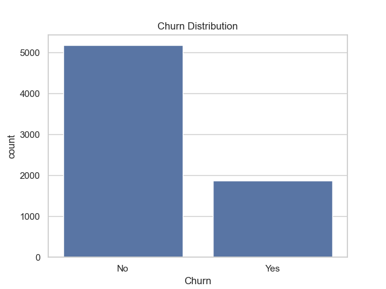

---

### Tenure vs Churn
Customers with lower tenure are more likely to churn.

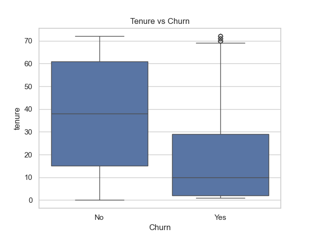

---

### Monthly Charges vs Churn
Higher monthly charges are associated with increased churn probability.

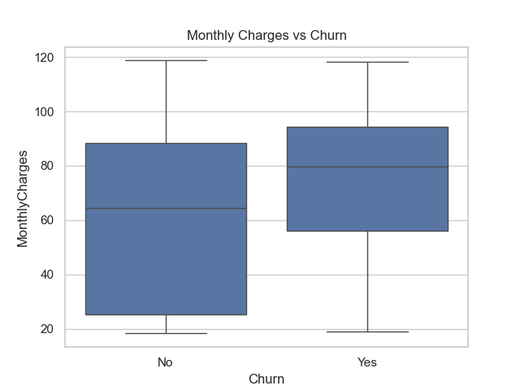

---

### Churn by Contract Type
Month-to-month contracts show significantly higher churn compared to long-term contracts.

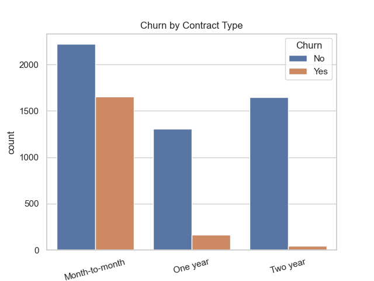

---

### Churn by Internet Service
Customers using fiber optic internet tend to churn more compared to DSL users.

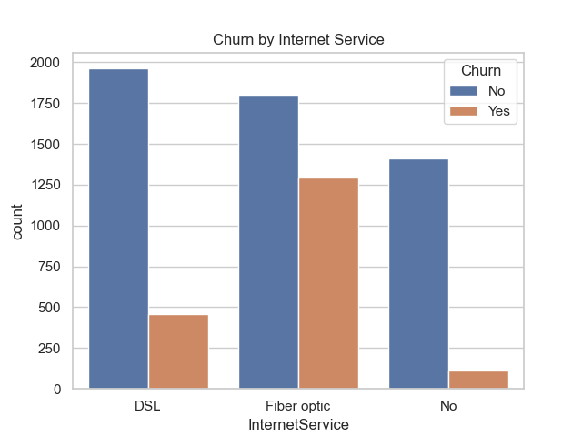

---

### Churn by Tech Support
Customers without technical support churn at a much higher rate.

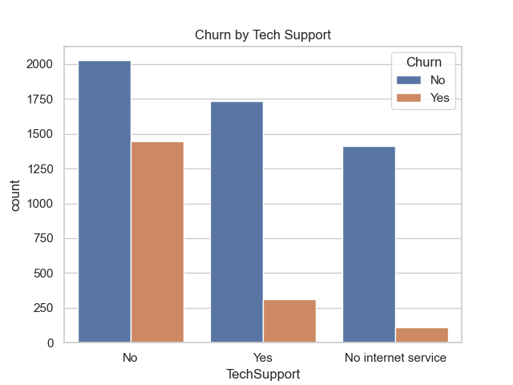

---

### Correlation Heatmap
This heatmap shows correlations between numerical features.

---

### Churn Rate by Contract Type
Stacked bar chart showing churn proportion across different contract types.

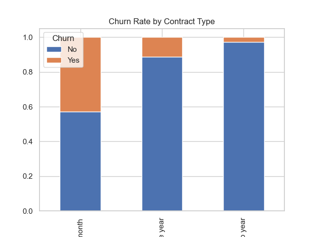

---

## 🧹 Data Cleaning & Feature Engineering

The raw dataset was cleaned and transformed to prepare it for machine learning.

### Steps Performed:
- Converted `TotalCharges` to numeric
- Handled missing values using median imputation
- Dropped irrelevant columns (`customerID`)
- Encoded target variable (`Churn`)
- Binary encoded categorical features
- One-hot encoded multi-category features
- Created new features:
  - `AvgMonthlySpend`
  - `HighValueCustomer`
- Scaled numerical features using `StandardScaler`

The final cleaned dataset was saved for modeling.

---

## 🤖 Model Building

A **Random Forest Classifier** was trained on the processed dataset due to its ability to:
- Handle non-linear relationships
- Work well with mixed feature types
- Provide probability-based predictions

---

## 📊 Model Evaluation

Multiple evaluation metrics and visualizations were used to assess model performance.

### Confusion Matrix
Shows correct and incorrect classifications.

---

### Model Performance Metrics
Accuracy, Precision, Recall, and F1-score comparison.

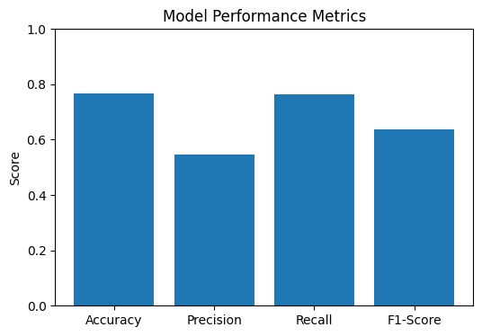

---

### ROC Curve
Displays the trade-off between true positive rate and false positive rate.

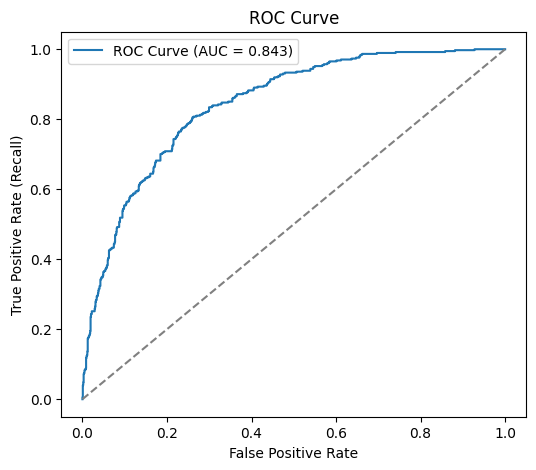

---

### Precision–Recall Curve
Evaluates model performance for imbalanced classification.

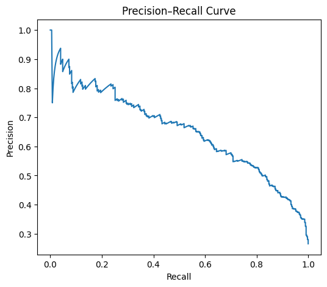

---

## 🔮 Churn Prediction System

The trained model predicts churn probability for a given customer and assigns a risk level:

- **High Risk**: Probability ≥ 0.6
- **Medium Risk**: 0.3 ≤ Probability < 0.6
- **Low Risk**: Probability < 0.3

### Example Prediction Output

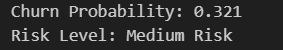

---

### Churn vs Monthly Charges (Prediction Insight)

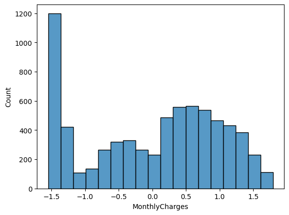

---

## 💾 Model Persistence

The trained model and scaler were saved using `joblib` for future reuse or deployment.

---

## ✅ Final Conclusion

This project demonstrates a complete **real-world data science pipeline**, covering:
- Data exploration and visualization
- Data cleaning and preprocessing
- Feature engineering
- Machine learning modeling
- Model evaluation
- Business-focused churn prediction

## 🚀 Skills Demonstrated

- Python (Pandas, NumPy)
- Data Visualization (Matplotlib, Seaborn)
- Feature Engineering
- Machine Learning (Scikit-learn)
- Model Evaluation
- Model Persistence
- Business Insight Generation
