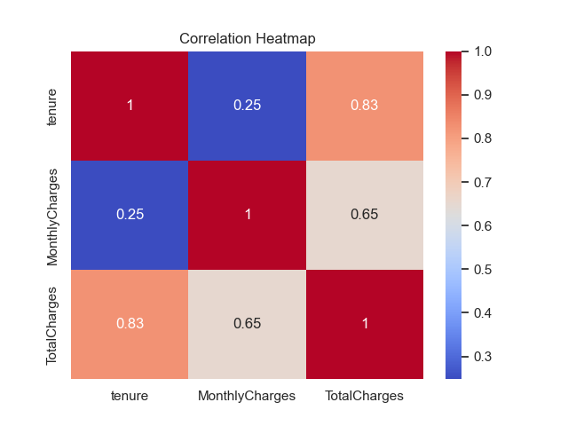
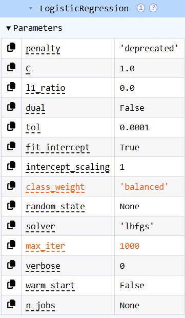
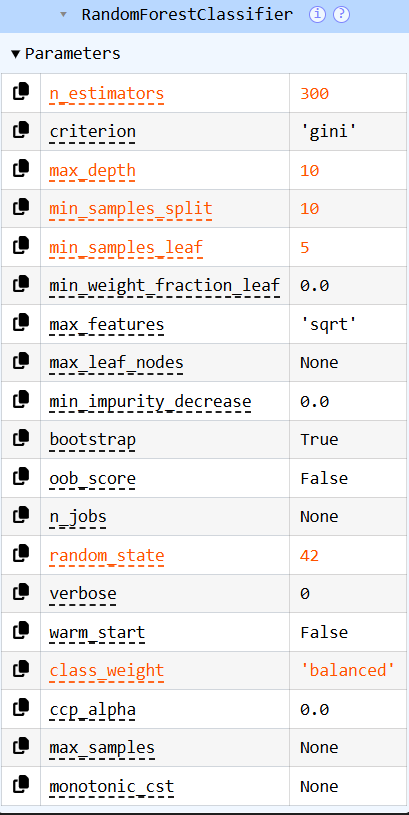
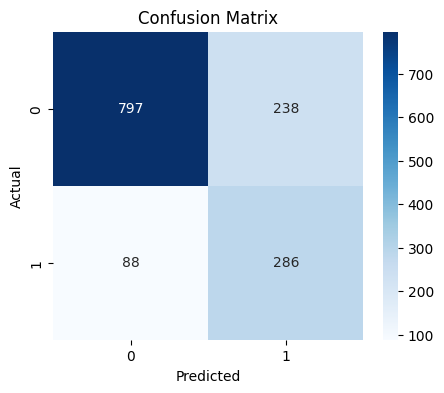
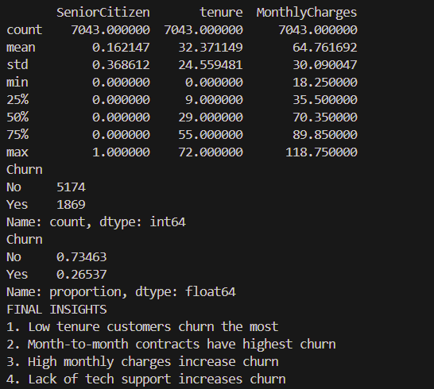

# 📊 Customer Churn Analysis & Prediction System using EDA and ML

An end-to-end **Data Science and Machine Learning project** that analyzes customer churn behavior in a telecom dataset.  
The project follows a complete pipeline including **Exploratory Data Analysis (EDA), data cleaning, feature engineering, training multiple ML models, model evaluation, and churn risk prediction**.

**Customer churn** refers to the percentage of customers who stop using a company’s service over a given period and is a key business metric in subscription-based industries.

---

## 📌 Project Objective

The objectives of this project are to:
- Understand why customers churn using data-driven analysis
- Identify features that strongly influence churn
- Perform robust data cleaning and feature engineering
- Train and compare **multiple machine learning models**
- Evaluate models using standard classification metrics
- Predict churn probability and classify customer risk
- Save trained models for reuse or deployment

---

## 📁 Dataset Overview

The dataset contains customer-level telecom information including:
- **Demographics**: gender, partner, dependents  
- **Service usage**: internet service, phone service, streaming services  
- **Account information**: tenure, contract type, payment method  
- **Billing details**: monthly charges, total charges  
- **Target variable**: `Churn` (Yes / No)

---

## 🔍 Exploratory Data Analysis (EDA)

EDA was conducted to understand data distributions, detect patterns, and extract business insights using visualizations and summary statistics.

### Churn Distribution  
Shows the overall proportion of churned vs retained customers.

---

### Tenure vs Churn  
Customers with lower tenure are significantly more likely to churn, indicating early-stage dissatisfaction.

---

### Monthly Charges vs Churn  
Higher monthly charges are associated with increased churn probability.

---

### Churn by Contract Type  
Month-to-month contracts exhibit the highest churn, while long-term contracts improve retention.

---

### Churn Rate by Contract Type  
Stacked bar chart showing churn proportion across different contract types.

---

### Churn by Internet Service  
Fiber optic customers churn more frequently compared to DSL customers.

---

### Churn by Tech Support  
Customers without technical support churn at a much higher rate.

---

### Correlation Heatmap  
Shows relationships between numerical variables such as tenure, monthly charges, and total charges.

---

## 🧹 Data Cleaning & Feature Engineering

The raw dataset required multiple preprocessing steps before modeling.

### Data Cleaning
- Converted `TotalCharges` from string to numeric
- Handled missing values using **median imputation**
- Dropped non-informative identifier column (`customerID`)
- Converted target variable (`Churn`) to binary format

### Feature Encoding
- Binary encoding for:
  - gender, partner, dependents, phone service, paperless billing
- One-hot encoding for multi-category features:
  - contract type, payment method, internet-related services

### Feature Engineering
- **AvgMonthlySpend** = `TotalCharges / (tenure + 1)`
- **HighValueCustomer** = 1 if `MonthlyCharges > 70`, else 0

### Feature Scaling
- Applied **StandardScaler** to numerical features:
  - tenure
  - MonthlyCharges
  - TotalCharges
  - AvgMonthlySpend

The cleaned dataset was saved as:
data/processed/churn_cleaned.csv

---

## 🤖 Machine Learning Models

Two machine learning models were trained and compared.

### 1️⃣ Logistic Regression (Baseline Model)
- Simple and interpretable
- Used to establish a baseline performance
- Produces probability-based churn predictions

---

### 2️⃣ Random Forest Classifier (Final Model)
- Ensemble-based model
- Captures non-linear relationships and feature interactions
- More robust to noise and outliers

---

## 📊 Model Evaluation & Metrics

Models were evaluated using standard classification metrics and visual tools.

### Confusion Matrix  
Shows true positives, true negatives, false positives, and false negatives.

---

### Evaluation Metrics  
Accuracy, Precision, Recall, and F1-score comparison.

---

### ROC Curve  
Illustrates the trade-off between True Positive Rate and False Positive Rate.  
Higher AUC indicates better discriminatory power.

---

### Precision–Recall Curve  
Particularly important for imbalanced datasets like churn prediction.

---

## 🏆 Model Selection

After evaluating both models:
- Random Forest achieved higher recall and ROC-AUC
- Reduced false negatives (critical for churn prediction)
- Selected as the **final production model**

---

## 🔮 Churn Prediction & Risk Classification

The final model predicts churn probability and assigns a customer risk level.

| Probability Range | Risk Level |
|------------------|-----------|
| ≥ 0.6 | High Risk |
| 0.3 – 0.6 | Medium Risk |
| < 0.3 | Low Risk |

### Example Prediction Output

---

### Churn vs Monthly Charges (Prediction Insight)

---

### 📌 Summary Statistics & Key EDA Insights

The following output summarizes the dataset statistics, churn distribution, and the final insights derived from exploratory data analysis.

## 💾 Model Persistence

The trained model and scaler were saved using `joblib` for future reuse or deployment.

These can be reused for:
- APIs
- Dashboards
- Batch or real-time predictions

---

## ✅ Final Conclusion

This project demonstrates a **complete real-world data science workflow**, including:
- Comprehensive EDA with business insights
- Robust data cleaning and feature engineering
- Training and comparison of multiple ML models
- Model evaluation using industry-standard metrics
- Probability-based churn risk prediction
- Model persistence for deployment readiness

---

## 🚀 Skills Demonstrated

- Python (Pandas, NumPy)
- Data Visualization (Matplotlib, Seaborn)
- Feature Engineering
- Machine Learning (Scikit-learn)
- Model Comparison & Evaluation
- Probability-Based Risk Modeling
- Business Insight Generation
